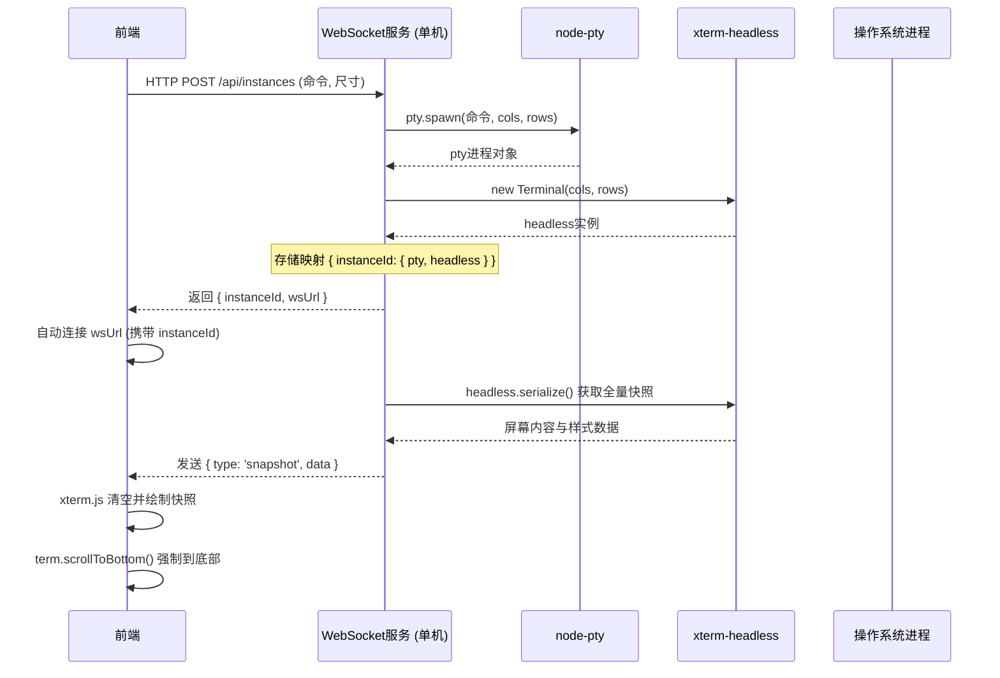
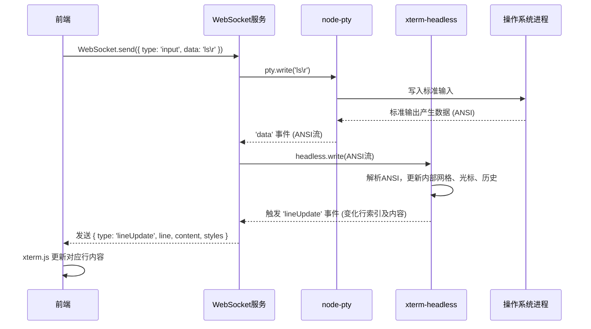
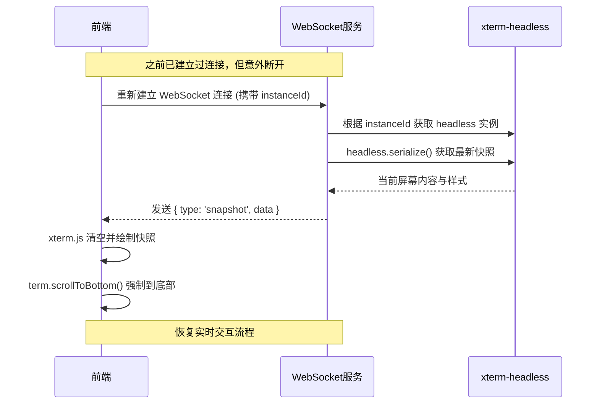

在单机模式（MVP）下，整个系统简化为一个单一进程，集成了 **Web 服务器**、**WebSocket 服务**、**node-pty** 和 **xterm-headless**。用户通过浏览器直接访问该进程，无需认证和分布式组件。以下是详细的单机模式工作流程：

---

### 1. 服务启动与前端加载
- **启动**：执行单机版二进制文件，它会在指定端口（如 `8080`）启动 HTTP 服务器和 WebSocket 服务。
- **前端加载**：用户浏览器访问 `http://localhost:8080`，服务端返回包含 `xterm.js` 前端代码的 HTML 页面。页面加载后，前端与 WebSocket 服务建立连接（通常使用同源路径，如 `ws://localhost:8080/ws`），此时连接尚未绑定到任何具体实例。

### 2. 创建 CLI 实例
- **用户操作**：前端页面提供一个表单，让用户输入要执行的命令（如 `bash`、`ping` 等）以及可选的初始终端尺寸（默认 80x25）。
- **发起创建**：用户提交表单，前端通过 HTTP POST 请求（或 WebSocket 发送创建消息）向服务端请求创建实例。
- **服务端处理**：
  - 分配一个唯一的实例 ID（如 `uuid` 或递增数字）。
  - **创建 node-pty 进程**：调用 `node-pty` 的 `spawn` 方法启动用户命令，传入工作目录、环境变量和初始终端尺寸。
  - **创建 xterm-headless 实例**：实例化一个 `Terminal` 对象，设置相同的尺寸和历史缓冲区大小（如 1000 行）。
  - **建立映射**：将 `实例ID`、`ptyProcess` 和 `headlessTerm` 存入内存 Map。
  - **启动数据转发**：监听 `ptyProcess` 的 `data` 事件，将输出数据直接写入 `headlessTerm.write(data)`，让 `headlessTerm` 解析 ANSI 并更新内部状态。
  - 返回创建成功响应，包含 `实例ID` 和 WebSocket 连接地址（如 `ws://localhost:8080/ws?instance_id=xxx`）。

用户通过前端表单提交命令，服务端创建 PTY 进程和 Headless 终端，并返回连接信息。



### 3. 连接到实例（首次连接）
- **前端连接**：前端自动使用返回的 WebSocket URL 建立新连接（或复用已有连接并发送 `attach` 消息）。连接建立后，前端携带 `instance_id` 告知服务端要连接哪个实例。
- **服务端处理**：
  - 根据 `instance_id` 找到对应的 `headlessTerm`。
  - **发送全量终端快照**：调用 `headlessTerm.serialize()` 或其他方法获取当前屏幕所有行的内容及样式（例如，可序列化为一个包含每行文本和样式的 JSON 数组）。
  - 通过 WebSocket 发送一个特殊消息（如 `{ type: 'snapshot', data: {...} }`）给前端。
- **前端渲染**：
  - 前端 `xterm.js` 收到 `snapshot` 消息后，清空当前终端内容，然后根据快照数据逐行绘制字符和样式。
  - 绘制完成后，**强制滚动到底部**：调用 `term.scrollToBottom()`（使用 `requestAnimationFrame` 确保 DOM 已更新）。这实现了“强制到底部”的体验。

### 4. 实时交互
- **用户输入**：用户在终端中按键，`xterm.js` 捕获输入数据（字符串），通过 WebSocket 发送给服务端。消息格式可为 `{ type: 'input', data: '...' }`。
- **写入 PTY**：服务端收到输入消息后，调用对应实例的 `ptyProcess.write(data)`，将数据写入伪终端。
- **PTY 输出**：命令执行产生输出时，`ptyProcess` 触发 `data` 事件，携带原始 ANSI 数据。
- **更新 Headless 状态**：服务端将 ANSI 数据写入 `headlessTerm.write(data)`，`headlessTerm` 解析并更新内部字符网格、光标位置和历史缓冲区。
- **推送增量更新**：为了高效同步，服务端需要捕获 `headlessTerm` 的状态变更并生成增量描述。这可以通过几种方式实现：
  - **轮询差异**（简单但低效）：定期比较整个网格，找出变化行。
  - **监听变更事件**（推荐）：`xterm-headless` 可能提供类似 `onLineUpdate` 的事件（需查阅 API），每当某行内容变化时触发。服务端监听这些事件，将变化行的新内容通过 WebSocket 推送给前端。
  - **每次写入后提取全量变更**：复杂但可控。  
  **简化实现**：在 MVP 阶段，可以每次 `headlessTerm` 更新后，将整个屏幕重新序列化并发送，但这样网络开销较大。更优方案是采用增量行更新：当 `headlessTerm` 内部某行改变时，发送 `{ type: 'lineUpdate', line: index, content: '...', styles: [...] }` 给前端。
- **前端渲染增量**：前端收到增量更新消息后，调用 `xterm.js` 的 API（如 `term.write` 或直接操作缓冲区）更新对应行的内容，实现实时显示。

用户输入命令，服务端将 PTY 输出解析为状态更新，并推送增量变化给前端。




### 5. 窗口尺寸调整
- **用户调整浏览器大小**：前端 `xterm.js` 监听到容器尺寸变化，计算出新的列数和行数，通过 WebSocket 发送 `{ type: 'resize', cols, rows }`。
- **服务端处理**：
  - 调用 `ptyProcess.resize(cols, rows)` 调整 PTY 尺寸。
  - 调用 `headlessTerm.resize(cols, rows)` 调整终端模拟器尺寸（注意：`xterm-headless` 的 `resize` 行为通常是清空历史缓冲区，符合需求文档简化要求）。
  - **重新同步**：由于历史被清空，服务端可以选择重新发送全量快照，让前端刷新画面。或者，可以根据需要仅发送当前屏幕内容。最简单的做法是再次执行“连接”流程：发送全量快照，前端强制到底部。

### 6. 历史滚动查看
- **用户向上滚动**：当用户用鼠标滚轮或滚动条向上滚动，`xterm.js` 检测到滚动位置超出当前可视区域顶部时，会触发一个事件。前端可监听该事件，并向服务端请求更多历史行。
- **请求历史**：前端发送 `{ type: 'fetchHistory', lines: 50 }`（请求 50 行历史）。
- **服务端处理**：
  - 通过 `headlessTerm` 的缓冲区 API（如 `term.buffer.active.getLine(lineIndex)`）从历史缓冲区中获取指定行数的内容和样式。
  - 将获取的行数据封装成消息（如 `{ type: 'history', lines: [...] }`）返回给前端。
- **前端插入**：前端收到历史行数据后，在 `xterm.js` 当前内容的顶部插入这些行，并调整滚动范围，实现向上无限滚动的效果。

### 7. 终止实例
- **用户操作**：前端页面提供“终止”按钮，点击后发送 `{ type: 'terminate', instance_id }` 消息。
- **服务端处理**：
  - 调用 `ptyProcess.kill()` 终止子进程。
  - 移除内存中该实例的映射，释放 `headlessTerm` 对象。
  - 可选地，向已连接的前端发送 `[Process completed]` 通知（或关闭 WebSocket 连接）。
- **资源清理**：如果实例进程意外退出（如用户直接退出 Shell），`node-pty` 会触发 `exit` 事件，服务端监听到后同样执行清理，并通知前端。

### 8. 断线重连
- **断开**：用户关闭标签页或网络临时中断，WebSocket 连接关闭。服务端检测到断开，但**不销毁实例**，仅标记该实例当前无前端连接。
- **重新打开页面**：用户再次访问页面，前端重新建立 WebSocket 连接，并携带之前使用的 `instance_id`（可通过 URL 参数或 localStorage 记住）。
- **服务端响应**：与首次连接相同，服务端找到对应的 `headlessTerm`，发送全量快照。
- **前端渲染并滚动到底部**：同步骤 3，前端渲染快照后强制滚动到底部。用户立即看到最新的终端状态，仿佛从未断开。

用户意外断开后重新连接，服务端再次推送当前全量快照，前端强制滚动到底部。



### 9. 实例列表查看（可选）
- **前端页面**：除了终端视图，还可以有一个列表页，展示所有活跃实例。
- **获取列表**：前端通过 HTTP API（如 `GET /api/instances`）获取实例摘要（ID、命令、运行时间等）。服务端遍历内存 Map，返回列表。
- **点击连接**：用户点击某实例卡片，进入终端视图，触发步骤 3 的连接流程。

---

### 关键数据结构示意（内存）
```javascript
// 服务端全局
const instances = new Map(); // key: instanceId, value: Instance

class Instance {
  constructor(id, pty, headless) {
    this.id = id;
    this.pty = pty;       // node-pty 进程对象
    this.headless = headless; // xterm-headless 实例
    this.ws = null;       // 当前连接的 WebSocket（若有）
  }
}
```

### 消息格式示例（WebSocket）
```json
// 服务端 -> 前端：全量快照
{
  "type": "snapshot",
  "data": {
    "rows": 25,
    "cols": 80,
    "lines": [
      { "text": "user@host:~$ ", "styles": [...] },
      { "text": "ping 127.0.0.1", "styles": [...] }
      // ...
    ]
  }
}

// 服务端 -> 前端：行更新
{
  "type": "lineUpdate",
  "line": 10,
  "content": "64 bytes from 127.0.0.1: icmp_seq=1 ttl=64 time=0.023 ms",
  "styles": [...] // 可包含每字符样式
}

// 前端 -> 服务端：输入
{
  "type": "input",
  "data": "ls -l\r"
}
```

### 总结

单机模式通过 **node-pty** 与真实进程交互，**xterm-headless** 维护精确终端状态，**xterm.js** 负责前端渲染，实现了完整的终端生命周期管理、实时交互、断线重连和历史查看。所有组件在单一进程中协作，无需外部依赖，完美契合 MVP 阶段的验证目标。此工作流程也为后续分布式演进提供了清晰的基础：只需将实例管理逻辑迁移到 Slave 节点，并添加 Master 作为转发层即可。

